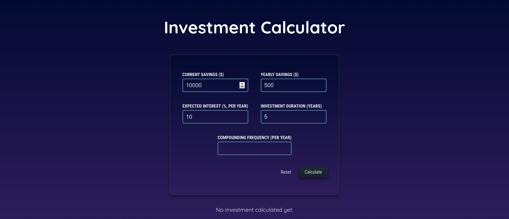

# react-projects-portfolio
This repository hosts a collection of my React applications, demonstrating a variety of web development skills and concepts. Each project showcases different aspects of React and related technologies.

# Investment App

This is a React-based investment app that helps users plan their investments and visualize the growth of their savings over time.

## Features

- Users can input their investment details, such as initial savings, yearly contributions, and interest rate.
- The app calculates the growth of the investment over a specified number of years.
- Results are displayed in a table and a line chart for easy visualization.

## Demo

[Watch the Demo Video](https://youtu.be/your-video-id)

## Usage

To run this app locally, you need Node.js and npm installed on your system. 

1. Clone or download this repository.
2. Install dependencies using `npm install`.
3. Start the development server using `npm start`.

The app will be available at `http://localhost:3000`.

## Technologies Used

- React
- Chart.js (via react-chartjs-2)
- CSS

## Future Improvements

- Add more investment options.
- Improve the mobile responsiveness of the app.
- Improve the design and user interface.

## License

MIT

